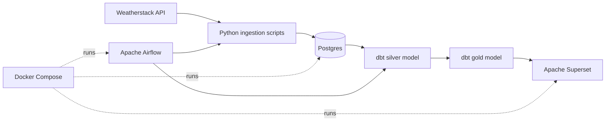

# ProductionWeatherdataETL

ProductionWeatherdataETL is a containerized data engineering project that ingests current weather data from the Weatherstack API, stores it in Postgres, transforms it with dbt, orchestrates the workflow with Airflow, and makes the modeled data available for analysis in Apache Superset.

The project is built as a local, production-style ETL stack. It is useful for practicing the core patterns used in real data platforms: API ingestion, database loading, scheduled orchestration, SQL modeling, and dashboard-ready analytics tables.

## What This Project Does

1. Calls the Weatherstack API for current weather data.
2. Loads each observation into a raw Postgres table.
3. Uses dbt to build cleaned and aggregated analytics tables.
4. Uses Airflow DAGs to schedule and orchestrate ingestion and transformation.
5. Uses Superset as the BI layer for querying and dashboarding the final tables.

The default API query is configured for New York in `repos/api_request/api_requests.py`. You can change the city by editing the Weatherstack query URL in that file.

## Architecture



### Data Flow

| Layer | Component | Purpose |
| --- | --- | --- |
| Extract | `api_requests.py` | Calls Weatherstack and returns the API response as JSON. |
| Load | `insert_data.py` | Creates the `weatherstack.weather_data` table and inserts weather observations. |
| Store | Postgres | Stores raw weather rows plus metadata databases for Airflow and Superset. |
| Transform | dbt | Builds clean `silver` and aggregated `gold` tables. |
| Orchestrate | Airflow | Schedules Python ingestion and dbt transformation DAGs. |
| Visualize | Superset | Connects to Postgres for SQL exploration, charts, and dashboards. |

## Tech Stack

- Python for API ingestion and database loading
- Postgres 17 for storage
- Apache Airflow 3 for orchestration
- dbt Postgres for SQL transformations
- Apache Superset for dashboards
- Redis for Superset caching
- Docker Compose for local infrastructure

## Repository Structure

```text
.
+-- README.md
+-- pyproject.toml
+-- main.py
+-- repos
    +-- api_request
    |   +-- api_requests.py
    |   +-- insert_data.py
    |   +-- .env.example
    +-- airflow
    |   +-- dags
    |       +-- orchestrator.py
    |       +-- dbt_orchestrator.py
    +-- dbt
    |   +-- profiles.yml
    |   +-- weather_project
    |       +-- dbt_project.yml
    |       +-- models
    |           +-- sources
    |           |   +-- sources.yml
    |           +-- silver
    |           |   +-- silver.sql
    |           +-- gold
    |               +-- gold.sql
    +-- postgres
    |   +-- init_metadata.sh
    +-- superset
    |   +-- Dockerfile
    |   +-- superset_config.py
    +-- .env.example
    +-- docker-compose.yaml
```

## Data Model

### Raw Table

`insert_data.py` loads Weatherstack responses into:

```text
database: weather_db
schema:   weatherstack
table:    weather_data
```

Important columns:

- `city`
- `temperature`
- `weather_description`
- `wind_speed`
- `time`
- `inserted_at`
- `utc_offset`

### dbt Models

| Model | Materialization | Description |
| --- | --- | --- |
| `silver` | table | Deduplicates weather rows by observation time and prepares local timestamps. |
| `gold` | table | Aggregates daily average temperature and wind speed by city. |

## Prerequisites

Install these before running the project:

- Docker Desktop
- Docker Compose
- Git
- A Weatherstack API key
- Python 3.13 or later, optional for running the Python scripts directly from your host machine

## Configuration

Create the main Docker Compose environment file:

```bash
cd repos
cp .env.example .env
```

Edit `repos/.env` and replace the placeholder values:

```env
POSTGRES_HOST_PORT=5001
POSTGRES_DB=weather_db
POSTGRES_USER=your_postgres_user
POSTGRES_PASSWORD=change_me_postgres_password

AIRFLOW_HOST_PORT=8000
AIRFLOW_DB=airflow_db
AIRFLOW_DB_USER=your_airflow_db_user
AIRFLOW_DB_PASSWORD=change_me_airflow_db_password

SUPERSET_HOST_PORT=8088
SUPERSET_DB=superset_db
SUPERSET_DB_USER=your_superset_db_user
SUPERSET_DB_PASSWORD=change_me_superset_db_password
SUPERSET_SECRET_KEY=change_me_to_a_long_random_secret_key
SUPERSET_ADMIN_USERNAME=admin
SUPERSET_ADMIN_PASSWORD=change_me_superset_admin_password
SUPERSET_ADMIN_EMAIL=admin@example.com
```

Create the Weatherstack API environment file:

```bash
cp api_request/.env.example api_request/.env
```

Edit `repos/api_request/.env`:

```env
API_KEY=your_weatherstack_api_key
```

For the Airflow DAG that runs dbt through Docker, set absolute host paths in `repos/.env`:

```env
DOCKER_SOCK=/var/run/docker.sock
DBT_PROJECT_HOST_PATH=/absolute/path/to/ProductionWeatherdataETL/repos/dbt/weather_project
DBT_PROFILES_HOST_PATH=/absolute/path/to/ProductionWeatherdataETL/repos/dbt
DBT_DOCKER_NETWORK=repos_my_network
```

On some macOS Docker Desktop setups, the Docker socket may be:

```env
DOCKER_SOCK=/Users/your_username/.docker/run/docker.sock
```

Do not commit real `.env` files or API keys.

## How To Run Locally

From the repository root:

```bash
cd repos
docker compose up -d --build
```

Check the containers:

```bash
docker compose ps
```

Open the local services:

| Service | URL |
| --- | --- |
| Airflow | http://localhost:8000 |
| Superset | http://localhost:8088 |
| Postgres | localhost:5001 |

The `dbt` service in Docker Compose runs once and exits after executing `dbt run`. Use the manual dbt commands below whenever you want to rerun transformations.

## Run The Pipeline With Airflow

Open Airflow:

```text
http://localhost:8000
```

The project includes two DAGs:

| DAG | Purpose |
| --- | --- |
| `extract_weather_data` | Runs the Python ingestion script every 5 minutes. |
| `dbt_orchestrator` | Runs ingestion first, then executes dbt in a Docker container. |

If Airflow asks for a login, check the Airflow container logs. `airflow standalone` prints the generated local admin credentials during startup:

```bash
docker compose logs airflow
```

## Run The Python ETL Manually

Start the database:

```bash
cd repos
docker compose up -d database
```

From the repository root, run the insert script with uv:

```bash
uv run python repos/api_request/insert_data.py
```

Or run the script from inside the Airflow container after the stack is up:

```bash
cd repos
docker compose exec airflow python /opt/airflow/api_request/insert_data.py
```

## Run dbt Manually

From `repos/`:

```bash
docker compose run --rm dbt debug
docker compose run --rm dbt run
```

Run a specific model:

```bash
docker compose run --rm dbt run --select silver
docker compose run --rm dbt run --select gold
```

## Query Postgres

Open a Postgres shell:

```bash
docker exec -it postgres_container psql -U <POSTGRES_USER> -d <POSTGRES_DB>
```

List weather tables:

```sql
\dt weatherstack.*
```

Query raw weather data:

```sql
select * from weatherstack.weather_data order by inserted_at desc;
```

Query the dbt gold model:

```sql
select * from weatherstack.gold;
```

Exit psql:

```sql
\q
```

## Connect Superset To Postgres

Open Superset:

```text
http://localhost:8088
```

Log in with the values from `repos/.env`:

```text
username: SUPERSET_ADMIN_USERNAME
password: SUPERSET_ADMIN_PASSWORD
```

Add a database connection:

```text
Settings -> Database Connections -> + Database
```

Use these connection settings:

```text
Database type: PostgreSQL
Host: database
Port: 5432
Database: weather_db
Username: value of POSTGRES_USER
Password: value of POSTGRES_PASSWORD
```

SQLAlchemy URI format:

```text
postgresql+psycopg2://<POSTGRES_USER>:<POSTGRES_PASSWORD>@database:5432/<POSTGRES_DB>
```

Then add datasets from the `weatherstack` schema:

- `weather_data`
- `silver`
- `gold`

## Common Commands

Start everything:

```bash
cd repos
docker compose up -d --build
```

Stop everything:

```bash
docker compose down
```

View logs:

```bash
docker compose logs -f airflow
docker compose logs -f database
docker compose logs -f superset
```

Rerun dbt:

```bash
docker compose run --rm dbt run
```

Check running containers:

```bash
docker compose ps
```

## Troubleshooting

### Weatherstack API returns an error

Check that `repos/api_request/.env` exists and contains a valid key:

```env
API_KEY=your_weatherstack_api_key
```

### dbt_orchestrator fails with a mount or path error

Check the absolute paths in `repos/.env`:

```env
DBT_PROJECT_HOST_PATH=/absolute/path/to/ProductionWeatherdataETL/repos/dbt/weather_project
DBT_PROFILES_HOST_PATH=/absolute/path/to/ProductionWeatherdataETL/repos/dbt
```

These must be host machine paths because Airflow asks Docker to mount the dbt project into a dbt container.

### Docker socket is not found

Update `DOCKER_SOCK` in `repos/.env`.

Common values:

```env
DOCKER_SOCK=/var/run/docker.sock
DOCKER_SOCK=/Users/your_username/.docker/run/docker.sock
```

### Environment changes do not apply to Postgres

The Postgres data directory is persisted at `repos/postgres/data`. Database users and metadata databases are initialized only when the data directory is empty. If this is a local-only environment and you are okay losing local database data, stop the stack and remove that local data directory before starting again.

## Production Readiness Notes

This project is designed as a local production-style learning environment. For real production deployment, the same architecture would usually add:

- Managed Postgres, Snowflake, BigQuery, Redshift, or Databricks for analytics storage
- A secrets manager instead of `.env` files
- Separate Airflow webserver, scheduler, worker, and triggerer services
- Centralized logs, metrics, and alerts
- CI/CD for tests and deployments
- Backups and recovery plans
- HTTPS, authentication, and role-based access control
- Container orchestration with Kubernetes, ECS, or another production runtime

## License

Add a license before sharing or reusing this project publicly.
